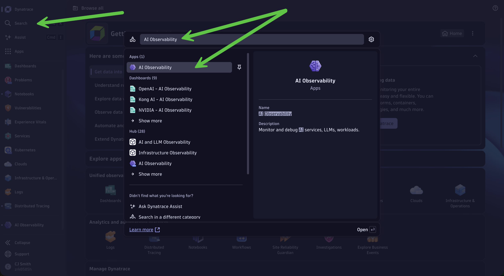
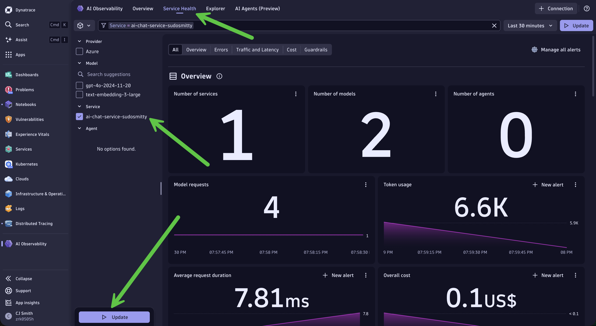
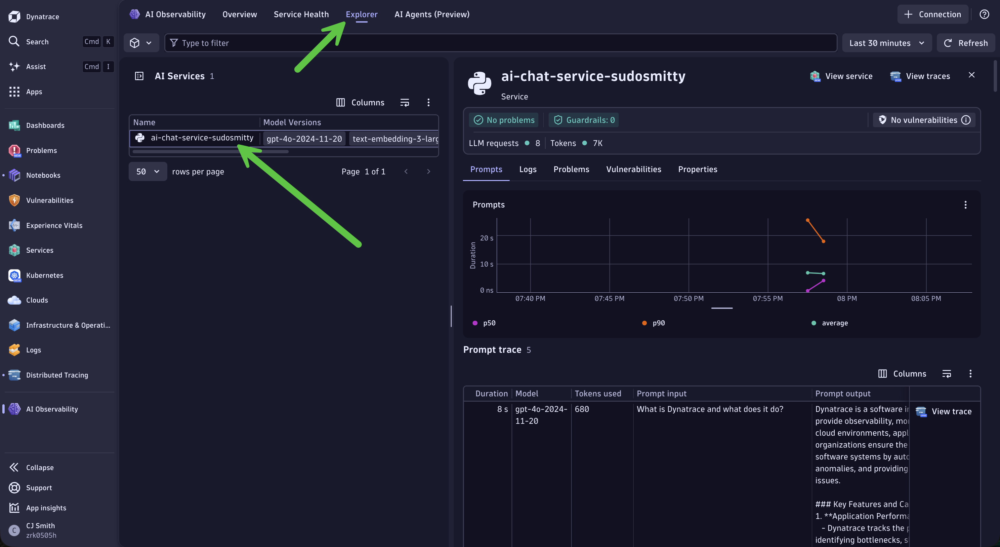
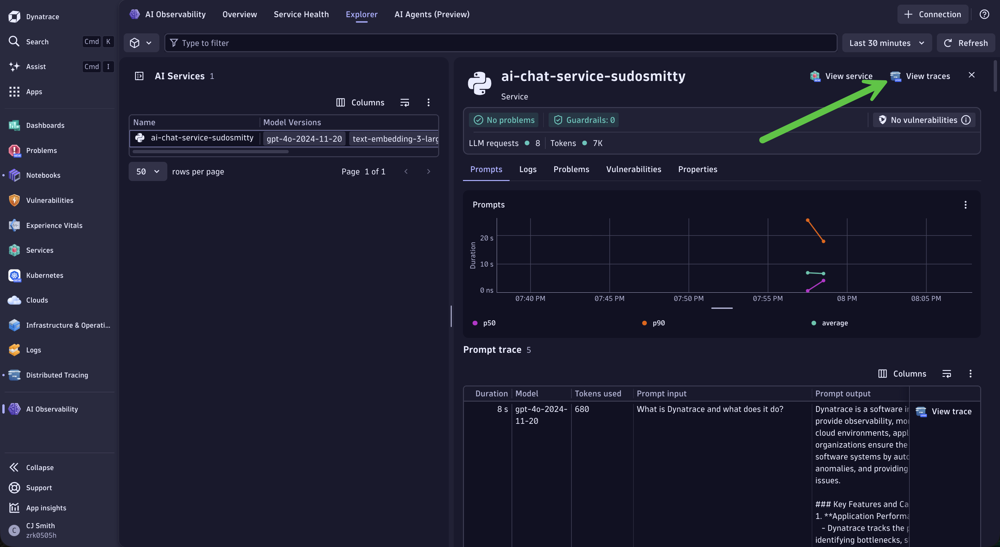
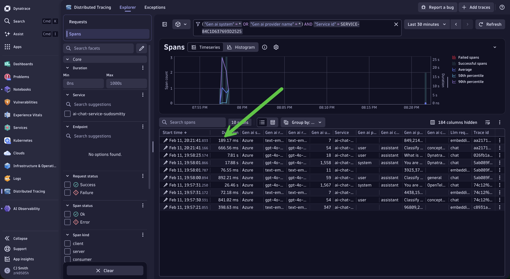
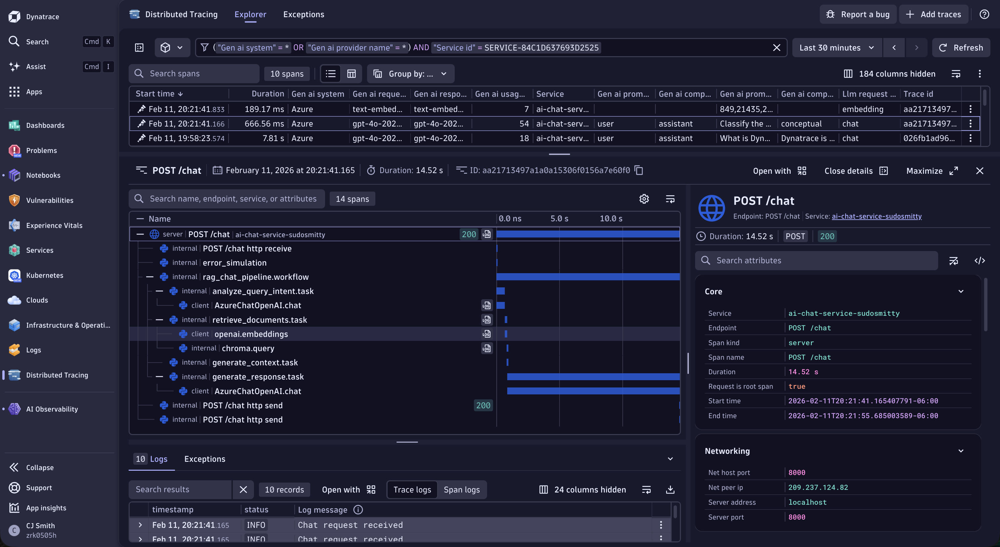

# Lab 2: Exploring AI Traces in Dynatrace

**Duration:** ~30 minutes

In this lab, you'll explore the traces generated by your AI application in Dynatrace, understanding the insights available for LLM and RAG observability.

---

## Learning Objectives

- Navigate to distributed traces in Dynatrace
- Analyze LLM call details including prompts and completions
- Understand token usage and cost attribution
- Explore RAG pipeline spans (embeddings, vector search, completion)
- Create basic queries for AI observability

---

!!! tip "Why Dynatrace for AI Observability?"
    | Capability | Basic Tracing | Dynatrace |
    |------------|---------------|------------|
    | Collect traces | ✅ OpenTelemetry | ✅ Native OTLP + OpenLLMetry |
    | See token counts | ✅ In span attributes | ✅ Unified with cost analysis |
    | Correlate to infra | ❌ Manual | ✅ Davis AI auto-correlation |
    | Root cause analysis | ❌ You investigate | ✅ Davis AI automatic RCA |
    | Anomaly detection | ❌ Static thresholds | ✅ AI-powered baselines |
    | Take action | ❌ External tools | ✅ Built-in Workflows |

---

## Step 1: Access Dynatrace

Open the Dynatrace environment URL provided by your instructor:

```
https://YOUR_ENV.live.dynatrace.com
```

Use the credentials provided by your instructor.

---

## Step 2: Find Your Service

### 2.1 Navigate to the AI Observability App

1. In the left navigation menu, click **Search**
2. Search for **AI Observability** and select the app

   

### 2.2 Explore Service Health

1. Click **Service Health** on the top
2. Choose `ai-chat-service-{YOUR_ATTENDEE_ID}` from the list and click **Update**

   

This shows your service health metrics: Errors, Traffic, Latency, Cost, and Guardrails.

---

## Step 3: Explore Prompt and Trace Data

### 3.1 Explore Prompts

1. Click **Explorer** on the top
2. Choose `ai-chat-service-{YOUR_ATTENDEE_ID}` from the list

   

### 3.2 Access Traces and Spans

Select **View traces** on the top right.

   

This brings you to the **Distributed Tracing** app with a list of spans.

   

### 3.3 Select a Trace

Click any trace to view the details.

   

---

## Choose Your Persona

From this point, focus on the path most relevant to your role.

---

## 💻 Developer: "Why is my RAG giving bad answers?"

**Your story:** You've deployed a RAG-powered chatbot, but users are complaining. You need to understand what's happening inside the pipeline.

### Step 4: Analyze an AI Trace

#### 4.1 Understanding the Trace Structure

A typical RAG request trace includes these spans:

```
📍 rag_chat_pipeline.workflow (Main RAG pipeline)
  └── 📍 analyze_query_intent.task (Classify user query type)
      └── 📍 AzureChatOpenAI.chat (LLM call for classification)
  └── 📍 retrieve_documents.task (Document retrieval)
      └── 📍 openai.embeddings (Generate query embedding)
      └── 📍 chroma.query (Vector store search)
  └── 📍 generate_context.task (Format retrieved docs)
  └── 📍 generate_response.task (Generate final answer)
      └── 📍 AzureChatOpenAI.chat (LLM completion call)
```

#### 4.2 Examine the LLM Span

Click the `azure_openai.chat` span:

| Attribute | Description |
|-----------|-------------|
| `gen_ai.system` | The LLM provider (Azure) |
| `gen_ai.request.model` | The model requested (gpt-4o-2024-11-20) |
| `gen_ai.response.model` | The model that responded |
| `gen_ai.request.temperature` | Temperature setting |
| `gen_ai.usage.input_tokens` | Number of input tokens |
| `gen_ai.usage.output_tokens` | Number of output tokens |
| `gen_ai.usage.cache_read_input_tokens` | Cached input tokens |

#### 4.3 View Prompts and Responses

You may see these span attributes:

- `gen_ai.prompt.0.content` — Input prompt content
- `gen_ai.prompt.0.role` — Prompt role (user, system)
- `gen_ai.completion.0.content` — Generated response content
- `gen_ai.completion.0.role` — Completion role (assistant)
- `gen_ai.completion.0.finish_reason` — Why generation stopped

---

### Step 5: Analyze Embedding Spans

In the trace view, locate the `openai.embeddings` span.

| Attribute | Description |
|-----------|-------------|
| `gen_ai.request.model` | Embedding model (text-embedding-3-large) |
| `gen_ai.usage.input_tokens` | Tokens in the text being embedded |
| `gen_ai.system` | The provider (Azure) |

---

### Step 6: Vector Store Spans

Find the `chroma.query` span.

| Attribute | Description |
|-----------|-------------|
| `db.system` | The vector database (chroma) |
| `db.operation` | The operation performed (query) |
| `db.chroma.query.n_results` | Number of documents retrieved |
| `db.chroma.query.embeddings_count` | Number of embeddings in the query |

---

### Step 7: Token Optimization

#### Understanding Token Limits

| Model | Max Input Tokens | Max Output Tokens |
|-------|-----------------|-------------------|
| GPT-4o | 128,000 | 16,384 |

#### Lookup Tables

This lab uses [lookup tables](https://docs.dynatrace.com/docs/shortlink/grail-lookup-data) to reference model token limits dynamically.

To see the table:

```
load "/lookups/ai/azure-openai/model-max-tokens"
```

To see all lookup tables:

```
fetch dt.system.files
```

#### 7.1 Create a New Notebook

1. Navigate to **Notebooks** in the left-hand menu
2. Click **+ Notebook** on the top
3. Name it: `AI Observability - {YOUR_ATTENDEE_ID}`
4. For each DQL query, create a new DQL tile

#### 7.2 Find Token Spenders and Usage Percentage

```sql
//Find the Biggest Token Spenders and Understand What Percentage of Token Limits are Used
fetch spans
| filter service.name == "ai-chat-service-{YOUR_ATTENDEE_ID}"
| filter isNotNull(gen_ai.usage.input_tokens)
| summarize 
    total_input = sum(gen_ai.usage.input_tokens),
    total_output = sum(gen_ai.usage.output_tokens),
    avg_input = avg(gen_ai.usage.input_tokens),
    avg_output = avg(gen_ai.usage.output_tokens),
    request_count = count(),
  by: {gen_ai.response.model}
| fieldsAdd total_tokens = total_input + total_output
| lookup [load "/lookups/ai/azure-openai/model-max-tokens"], sourceField:gen_ai.response.model, lookupField:model
| filter isNotNull(lookup.model)
| fieldsAdd input_token_usage_percent = (avg_input / lookup.max.tokens.input)*100
| fieldsAdd output_token_usage_percent = (avg_output / lookup.max.tokens.output)*100
| fieldsRemove "lookup*"
| fields gen_ai.response.model, request_count, total_input, total_output, avg_input, avg_output, input_token_usage_percent, output_token_usage_percent
```

---

## 🔧 SRE/Platform: "How much is this AI service costing us?"

**Your story:** Leadership wants cost and capacity answers before this AI feature scales.

### Step 8: Using Notebooks for AI Analysis

#### 8.1 Create a New Notebook

1. Navigate to **Notebooks** in the left-hand menu
2. Click **+ Notebook**, name it: `AI Observability - {YOUR_ATTENDEE_ID}`

#### 8.2 Query: Model Usage Distribution

```sql
//Model Usage Distribution
fetch spans
| filter service.name == "ai-chat-service-{YOUR_ATTENDEE_ID}"
| filter isNotNull(gen_ai.response.model)
| summarize request_count = count(), by: {gen_ai.response.model}
| sort request_count desc
```

!!! tip
    Click **Options** > **Visualization** and select "Pie" for a better view.

#### 8.3 Query: Average Response Time by Operation

```sql
//Average Response Time by Operation
fetch spans
| filter service.name == "ai-chat-service-{YOUR_ATTENDEE_ID}"
| summarize 
    avg_duration = avg(duration),
  by: {span.name}
| sort avg_duration desc
```

---

### Step 9: Token Economics Analysis

#### Understanding Token Costs

| Model | Input Cost (per 1M tokens) | Output Cost (per 1M tokens) |
|-------|---------------------------|------------------------------|
| GPT-4o | $2.50 | $10.00 |
| GPT-4o-mini | $0.15 | $0.60 |
| text-embedding-3-large | $0.13 | N/A |

This lab uses a lookup table with Azure OpenAI pricing. To see it:

```
load "/lookups/ai/azure-openai/model-costs"
```

#### 9.1 Find Your Biggest Token Spenders

```sql
//Find Your Biggest Token Spenders
fetch spans
| filter service.name == "ai-chat-service-{YOUR_ATTENDEE_ID}"
| filter isNotNull(gen_ai.usage.input_tokens)
| summarize 
    total_input = sum(gen_ai.usage.input_tokens),
    total_output = sum(gen_ai.usage.output_tokens),
    avg_input = avg(gen_ai.usage.input_tokens),
    request_count = count(),
    by: {gen_ai.response.model}
| fieldsAdd total_tokens = total_input + total_output
| lookup [load "/lookups/ai/azure-openai/model-costs"], sourceField:gen_ai.response.model, lookupField:model
| filter isNotNull(lookup.model)
| fieldsAdd estimated_cost_usd = (total_input * lookup.input.cost + total_output * if(isNull(lookup.output.cost),0.00,else:lookup.output.cost)) / 1000000
| fieldsRemove "lookup*"
| sort estimated_cost_usd desc
```

!!! tip
    High avg_input tokens? Your system prompt or context might be too large. Consider summarizing retrieved documents before adding to context.

#### 9.2 Prompt Caching Effectiveness

Azure OpenAI caches prompts > 1024 tokens. Check your cache hit rate:

```sql
//Prompt Caching Effectiveness
fetch spans
| filter service.name == "ai-chat-service-{YOUR_ATTENDEE_ID}"
| filter isNotNull(gen_ai.usage.cache_read_input_tokens)
| summarize 
    cached_tokens = sum(gen_ai.usage.cache_read_input_tokens),
    total_tokens = sum(gen_ai.usage.input_tokens)
| fieldsAdd cache_rate_percent = (toDouble(cached_tokens) / toDouble(total_tokens)) * 100
```

!!! tip
    Low cache rate (<30%)? Standardize system prompts and use longer static prefixes (1024+ tokens).

#### 9.3 Token Trend Analysis

```sql
//Token Trend Analysis
fetch spans
| filter service.name == "ai-chat-service-{YOUR_ATTENDEE_ID}"
| filter isNotNull(gen_ai.usage.input_tokens)
| makeTimeseries 
    total_input = sum(gen_ai.usage.input_tokens),
    total_output = sum(gen_ai.usage.output_tokens),
    request_count = count()
```

#### 9.4 What To Do With Token Data

| Finding | Indicates | Action |
|---------|-----------|--------|
| High input tokens | Large prompts/context | Reduce system prompt, compress context |
| High output tokens | Verbose responses | Add length constraints to prompts |
| Low cache rate | Inconsistent prompts | Standardize prompt templates |
| Token spikes | Potential abuse/bugs | Set up alerts, investigate queries |

---

## Checkpoint

- [ ] Found your service in Dynatrace
- [ ] Viewed distributed traces for your AI requests
- [ ] Identified LLM spans and their attributes
- [ ] Seen token usage metrics
- [ ] Created DQL queries in Notebooks
- [ ] Understood the trace structure (HTTP → Embedding → Vector → LLM)

---

## Troubleshooting

**"No traces found"** — Wait 1-2 minutes. Verify `ATTENDEE_ID` is correct. Check `DT_ENDPOINT` and `DT_API_TOKEN`.

**"Missing LLM attributes"** — Ensure you're using the traceloop-sdk. Check span details for available attributes.

**"Service not appearing"** — Send a few more requests. Refresh the Dynatrace UI.

---

[← Lab 1: Instrumentation](lab1-instrumentation.md) | [Lab 3: Dynatrace MCP →](lab3-dynatrace-mcp.md)
